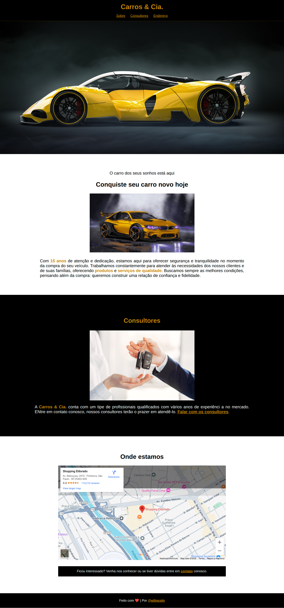

# 🏎️ Carro & Cia.

Este projeto apresenta um site fictício para uma concessionária de veículos. O layout moderno e atrativo foi desenvolvido com HTML e CSS puro, destacando os carros, consultores especializados e localização da loja.

Aqui eu destaco fortemente o estudo em position fixed para fixação do menu principal. O projeto foi feito inteiro para esse aprendizado.

---

## 🧠 Conceitos Trabalhados

- Estruturação semântica com HTML5
- Estilização com CSS
- Inclusão de mapa via iframe
- Organização de conteúdo por seções
- Navegação com links internos
  -Separação de conteúdo por seções (Sobre, Consultores, Endereço)

---

## 🔍 Preview do Projeto

---

## 🧱 Tecnologias Utilizadas

- **HTML5**
- **CSS3**

---

## 📄 Licença

Este projeto está licenciado sob a MIT License.
Você pode usar, modificar e distribuir como quiser. Criado para fins educacionais e de prática em desenvolvimento web.
